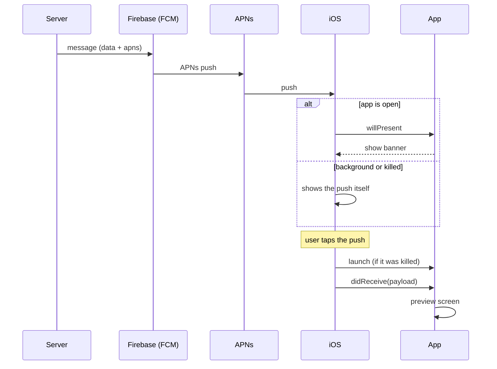

# PushWakeUpDemo

**English** · [Русский](README.ru.md)

An iOS demo app showing how a call push notification (e.g. from an intercom) delivers
its data to the app and how the app gets "woken up".

The goal is the **wake-up mechanics**, not the call itself. SIP, video and door opening
are out of scope: once the app is awake and has the payload, regular call logic takes over.

There is very little material on this topic, so the code and docs are intentionally detailed.
Code comments are in Russian.

## Contents

- [Roadmap](#roadmap)
- [How regular pushes work](#how-regular-pushes-work)
- [Payload](#payload)
- [Project structure](#project-structure)
- [Setup](#setup)
- [Testing on the simulator without a server](#testing-on-the-simulator-without-a-server)
- [Testing on an iPhone via Firebase](#testing-on-an-iphone-via-firebase)
- [FAQ](#faq)

## Roadmap

| Stage | What it shows | Status |
|---|---|---|
| 1 | Regular push (Firebase): payload, banner while the app is open, tap → preview screen, cold start | ✅ |
| 2 | Push action buttons (Answer / Decline) and handling a swipe-to-dismiss | ✅ |
| 3 | Modifying the push on the device: Notification Service Extension | ⏳ |
| 4 | VoIP push: PushKit + CallKit — waking the app without user interaction | ⏳ |
| 5 | Settings: VoIP on/off, notification permission status | ⏳ |

## How regular pushes work

Key point: **a regular push does not wake the app by itself.** Until the user taps it,
the app knows nothing about it (unless it was already open).

| Situation | What happens |
|---|---|
| Push arrives, app is **open** | iOS calls `willPresent` asking how to present it. The demo logs it and answers "show a banner". No screen is opened. |
| Push arrives, app is **in background or killed** | iOS shows the push itself. The app is not launched and knows nothing. |
| User **taps the push** | If the app was killed, iOS launches it (`didFinishLaunching`), then calls `didReceive` with the payload → the preview screen opens. |
| User opens the app **from its icon** | The push is not passed to the app — it stays in Notification Center. |
| Badge on the icon | Set by `"badge": 1`. It never clears itself — the app resets it when opened. |



See `PushWakeUpDemo/App/AppDelegate+NotificationHandling.swift` for the commented code.

## Push buttons and swipe-to-dismiss (stage 2)

The server only sends the **category name** in the payload: `"category": "CALL_NOTIFICATION"`.
The buttons themselves are not in the push — on launch the app tells iOS which buttons this
category has (`PushWakeUpDemo/Push/CallNotificationCategory.swift`). From then on iOS shows them
by itself, even if the app is killed.

Buttons appear on a **long press** on the push; on the lock screen — swipe left → **View**.

| Action | Option | What iOS does | Log entry |
|---|---|---|---|
| Tap the push | — | Opens the app | "Нажали на пуш звонка" → preview screen |
| **Ответить** (Answer) | `.foreground` | Opens the app (asks to unlock the phone) | "Нажали «Ответить» в пуше" → preview screen |
| **Отклонить** (Decline) | no `.foreground`, `.destructive` (red) | Wakes the app **in background**, no screen, the phone stays locked | "Нажали «Отклонить» в пуше" · `в фоне` |
| **Dismissed** (swipe left → Clear) | `.customDismissAction` on the category | Wakes the app **in background** | "Пуш смахнули" · `в фоне` |

All actions arrive in the same `didReceive` method and differ by `response.actionIdentifier`:
`UNNotificationDefaultActionIdentifier` (tap), `CALL_ANSWER`, `CALL_DECLINE`,
`UNNotificationDismissActionIdentifier` (dismissed).

If the app was killed, the log shows "Приложение запущено · холодный старт" before the action:
`неактивно` (inactive) for tap and Answer, `в фоне` (background) for Decline and dismiss.

In background the app has a few seconds: a real app tells the server the call was declined
here, and only then calls `completionHandler`.

Without `.customDismissAction` a dismiss is silent — the app never learns about it.
Flicking a banner up while it's at the top of the screen is not a dismiss: the push stays in
Notification Center and no event arrives.

## Payload

This is how the server sends the push via **FCM HTTP v1** (`POST https://fcm.googleapis.com/v1/projects/<project-id>/messages:send`):

```
payload = {
        "message": {
            "token": "?",
            "data": {
                "service_url": "?",
                "panele_id": "?",
                "asterisk_url": "?",
                "addr": "TEST",
                "rtsp": "?",
                "type": "sip_call",
                "token": "?",
                "call_id": "?"
            },
            "apns": {
                "payload": {
                    "aps": {
                        "alert": {
                            "title": "Ожидайте звонка",
                            "body": "Домофон: TEST",
                        },
                        "sound": "customSound.wav",
                        "category": "CALL_NOTIFICATION",
                        "badge" : 1,
                    },
                },
            },
        }
    }
```

- `message.token` — the device's FCM token.
- `data` — our fields. `type = sip_call` tells the app it's a call.
- `apns.payload.aps` — what iOS displays: text, sound, category, badge.

### What the app receives

Firebase turns `message` into a regular APNs push. In the app (`userInfo`) it looks like this —
**the `data` fields are at the root**, next to `aps`:

```json
{
  "aps": { "alert": { "title": "...", "body": "..." }, "sound": "customSound.wav", "category": "CALL_NOTIFICATION", "badge": 1 },
  "type": "sip_call",
  "addr": "TEST",
  "call_id": "...",
  "gcm.message_id": "..."
}
```

Parsing: `PushWakeUpDemo/Push/PushNotificationData.swift`. A missing field doesn't break
parsing (it will be empty).

`customSound.wav` lives in the app bundle (`Resources/Sounds`). iOS only takes push sounds
from the bundle or `Library/Sounds` — a sound in Assets.xcassets won't play.

## Project structure

```
PushWakeUpDemo/
├── App/
│   ├── AppDelegate.swift                        — launch, window, badge reset
│   ├── AppDelegate+PushRegistration.swift       — permission, APNs token → FCM token
│   └── AppDelegate+NotificationHandling.swift   — push arrived / push tapped
├── Push/
│   ├── PushNotificationData.swift               — payload model
│   ├── NotificationType.swift                   — the "type" field
│   ├── CallNotificationCategory.swift           — call push buttons
│   └── FCMTokenStore.swift                      — latest FCM token
├── EventLog/
│   └── EventLog.swift                           — event log (survives relaunch)
├── Screens/
│   ├── Main/
│   │   ├── MainViewController.swift             — FCM token + event log
│   │   └── AppEvent+Style.swift                 — icons and colors for event kinds
│   └── CallPreview/CallPreviewViewController.swift — screen opened by tapping the push
└── Resources/
    ├── GoogleService-Info.plist                 — ⚠️ not in git, add your own
    ├── PushWakeUpDemo.entitlements              — aps-environment (Push Notifications)
    ├── Info.plist                               — remote-notification background mode
    └── Sounds/customSound.wav
Scripts/
├── send_fcm_push.sh                             — send a push via FCM HTTP v1 (like the server)
├── make_app_icon.swift                          — draws the app icon (swift Scripts/make_app_icon.swift)
├── payloads/fcm_call.json                       — production payload for the script
├── payloads/sip_call.apns                       — the same push for the simulator (simctl)
└── secrets/service-account.json                 — ⚠️ not in git, service account key
```

The **event log** on the main screen is grouped by day ("Сегодня" / today, "Вчера" / yesterday, dates).
Each event has a colored icon by kind (launch, push, tap, token, error), the time and the app state
at that moment: `активно` (active), `неактивно` (inactive), `в фоне` (background), plus `холодный старт`
(cold start) if the process has just been launched. This shows exactly what woke the app.

## Setup

Requirements: Xcode 15+, iOS 15+. The only dependency is `FirebaseMessaging` (Swift Package Manager).

### 1. GoogleService-Info.plist

The file is **not in the repository** — everyone uses their own Firebase project.

1. [Firebase Console](https://console.firebase.google.com/) → create a project (or open yours).
2. Add an iOS app with bundle ID `com.churiqlab.PushWakeUpDemo`
   (or your own — then change *Bundle Identifier* in Xcode).
3. Download `GoogleService-Info.plist` and put it into `PushWakeUpDemo/Resources/`.

Without it the build fails with
`Build input file cannot be found: '.../PushWakeUpDemo/Resources/GoogleService-Info.plist'`.

### 2. Signing

Xcode → *PushWakeUpDemo* target → *Signing & Capabilities* → select your *Team*.
*Push Notifications* are already enabled (`aps-environment` in the entitlements).

## Testing on the simulator without a server

The simulator receives real pushes only on Apple Silicon Macs (iOS 16+), and not always:
in our test no APNs token arrived, so there was no FCM token either.
So on the simulator we deliver the push directly — it looks the same as after Firebase:

```bash
xcrun simctl push booted com.churiqlab.PushWakeUpDemo Scripts/payloads/sip_call.apns
```

Or just drag `Scripts/payloads/sip_call.apns` onto the simulator window.

1. **App is open.** Send the push → a banner appears, the log shows
   "Пуш пришёл при открытом приложении" (push arrived while open). No screen opens by itself.
2. **Tap the banner** → "Домофон: TEST" opens with the payload fields,
   the log shows "Нажали на пуш звонка" → "Экран предпросмотра показан".
3. **App is killed.** Close it via the app switcher (⌘⇧H twice → swipe up).
   Send the push → tap **the push** (banner or Notification Center — drag down from the top edge).
   Log: "Приложение запущено · холодный старт" → "Нажали на пуш звонка" → "Экран предпросмотра показан".
4. **Badge.** Send the app to background, send the push → "1" on the icon. Open the app → the badge is gone.
5. **Buttons.** Kill the app, send the push, long-press it with the mouse, or on the lock screen (⌘L) swipe left → View.
   Tap **Отклонить** (Decline) → the phone stays locked, the log shows "Приложение запущено · в фоне" →
   "Нажали «Отклонить» в пуше". **Ответить** (Answer) → the app opens with the preview.
6. **Dismiss.** Kill the app, send the push, in Notification Center or on the lock screen swipe left → **Clear**.
   Log: "Приложение запущено · в фоне" → "Пуш смахнули".

## Testing on an iPhone via Firebase

### Once: APNs key in Firebase

Firebase delivers the push to APNs itself, so it needs an Apple key.

1. [developer.apple.com](https://developer.apple.com/account/resources/authkeys/list) → *Certificates, IDs & Profiles* → *Keys* → **+**
   → enable **Apple Push Notifications service (APNs)** → *Continue* → *Register* → **Download**.
   The `.p8` file can be downloaded **only once** — keep it safe (and never commit it).
   Note the **Key ID** (same page) and your **Team ID** (top right of your account).
2. Firebase Console → ⚙️ *Project settings* → *Cloud Messaging* → *Apple app configuration*
   → *APNs Authentication Key* → **Upload**: the `.p8` file, Key ID, Team ID.

One `.p8` key works for all apps of the team and both environments (development and production).

### Running on an iPhone and the FCM token

1. Run the app on an iPhone from Xcode, allow notifications.
2. Log: "APNs-токен получен" → "FCM-токен получен". The token itself is shown:
   - **in the Xcode console** as a separate `FCM_TOKEN=...` line — the easiest, it's already on your Mac;
   - **at the top of the main screen** — tap it → Copy or AirDrop to your Mac;
   - in the "FCM-токен получен" log entry.

   The token changes after reinstalling the app — on `UNREGISTERED` take a new one.
   If you see "Ошибка регистрации в APNs" — check signing and *Push Notifications* in *Signing & Capabilities*.

### Option 1: Firebase console (quick, no setup)

1. Firebase Console → *Messaging* → *New campaign* → *Notifications*.
2. Title and text, e.g. "Ожидайте звонка" / "Домофон: TEST".
3. On the right, **Send test message** → paste the FCM token into *Add an FCM registration token* → **+** → **Test**.

The console can't set `category` or a custom sound, and may not pass the `data` fields into a test message.
**Without `category` the push has no Answer / Decline buttons** — use the script for them.
The log shows it: if tapping the push logs "Нажали на пуш, но это не звонок", `type` and the other fields didn't arrive.
To send **exactly the production payload**, use the script.

### Option 2: `Scripts/send_fcm_push.sh` (production payload, like the server)

The script sends `Scripts/payloads/fcm_call.json` via the FCM HTTP v1 API — the same request the server makes.
It only needs standard macOS tools: `curl`, `openssl`, `plutil`.

**Setup (once):**

1. Firebase Console → ⚙️ *Project settings* → *Service accounts* → **Generate new private key** → a JSON file downloads.
2. Save it as `Scripts/secrets/service-account.json`.
   `Scripts/secrets/` is in `.gitignore` — **the key is secret: never commit or share it**
   (it allows sending pushes on behalf of the project).

   You can keep the key elsewhere and pass the path:
   `FIREBASE_SERVICE_ACCOUNT=/path/to/key.json ./Scripts/send_fcm_push.sh ...`

**Sending:**

```bash
./Scripts/send_fcm_push.sh <FCM-token>
```

`✅ Отправлено: projects/.../messages/...` means Firebase accepted the push.

- Custom payload: `./Scripts/send_fcm_push.sh <FCM-token> path/to/payload.json`
  (same format as `fcm_call.json`; the script puts the token into `message.token`).
- See what would be sent without sending: `DRY_RUN=1 ./Scripts/send_fcm_push.sh <FCM-token>`

**How it works:** reads `project_id`, `client_email`, `private_key` from the key → signs a JWT →
exchanges it with Google for an OAuth token (`oauth2.googleapis.com/token`) →
`POST https://fcm.googleapis.com/v1/projects/<project_id>/messages:send`.

**Common errors** (the script prints a hint):

| Response | Cause |
|---|---|
| `UNREGISTERED` | Stale token: the app was reinstalled. Take a new one. |
| `SENDER_ID_MISMATCH` | Token from another Firebase project: `GoogleService-Info.plist` and the key are from different projects. |
| `THIRD_PARTY_AUTH_ERROR` | Firebase couldn't deliver to APNs: `.p8` not uploaded or wrong Key ID / Team ID. |
| `invalid_grant` | The service account key was deleted or is invalid — generate a new one. |

### What to check on the device

1. **App open** → banner, the log shows "Пуш пришёл при открытом приложении" with the payload fields.
2. **In background** → push with the `customSound.wav` sound and a badge, the app logs nothing.
3. **Killed** (swipe away in the app switcher) → tap the push → "Приложение запущено · холодный старт"
   → "Нажали на пуш звонка" → "Экран предпросмотра показан".

## FAQ

**Why doesn't the app open the screen by itself when a push arrives?**
By design: a regular push doesn't wake the app. Only a VoIP push can wake the app
without user interaction (stage 4).

**I opened the app but there's no preview screen.**
You probably opened it from the icon — then the push isn't passed to the app. Tap the push itself.

**Why didn't the badge disappear before?**
It is set by `"badge": 1` in the payload and never clears itself. The app has to reset it —
now this happens in `applicationDidBecomeActive`.

**No FCM token on the simulator.**
An FCM token is issued only after an APNs token. The simulator gets an APNs token only on
Apple Silicon Macs (iOS 16+), and not always. If the log has no "APNs-токен получен", test
Firebase on a real iPhone and use `simctl push` on the simulator.
