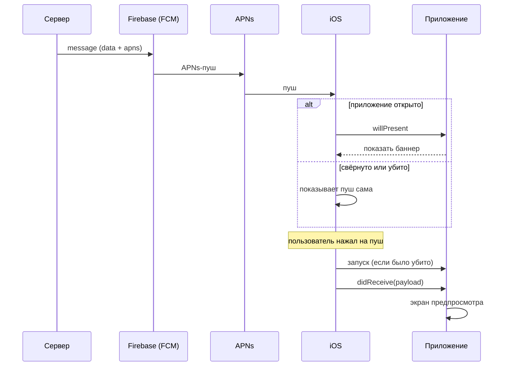

# PushWakeUpDemo

[English](README.md) · **Русский**

Демо-приложение для iOS: как пуш о звонке (например, с домофона) доставляет данные
в приложение и как приложение «просыпается».

Цель — показать **механику пробуждения**, а не сам звонок. SIP, видео и открытие двери
остаются за рамками: к моменту, когда приложение разбужено и получило payload,
дальше уже идёт обычная логика звонка.

Материалов по этой теме мало, поэтому код и описание сделаны максимально подробными.

## Содержание

- [Что уже есть и что будет](#что-уже-есть-и-что-будет)
- [Как работают обычные пуши](#как-работают-обычные-пуши)
- [Payload](#payload)
- [Структура проекта](#структура-проекта)
- [Запуск](#запуск)
- [Проверка на симуляторе без сервера](#проверка-на-симуляторе-без-сервера)
- [Проверка на iPhone через Firebase](#проверка-на-iphone-через-firebase)
- [Частые вопросы](#частые-вопросы)

## Что уже есть и что будет

| Этап | Что показывает | Статус |
|---|---|---|
| 1 | Обычный пуш (Firebase): payload, баннер при открытом приложении, нажатие → экран предпросмотра, холодный старт | ✅ |
| 2 | Кнопки в пуше («Ответить» / «Отклонить») и реакция на смахивание | ⏳ |
| 3 | Изменение пуша на устройстве: Notification Service Extension | ⏳ |
| 4 | VoIP-пуш: PushKit + CallKit — пробуждение приложения без участия пользователя | ⏳ |
| 5 | Настройки: вкл/выкл VoIP, статус разрешения на уведомления | ⏳ |

## Как работают обычные пуши

Главное: **обычный пуш сам приложение не будит.** Пока пользователь не нажал на пуш,
приложение о нём не знает (если оно не было открыто).

| Ситуация | Что происходит |
|---|---|
| Пуш пришёл, приложение **открыто** | iOS вызывает `willPresent` и спрашивает, как показать пуш. Демо пишет в журнал и отвечает «покажи баннер». Экран само не открывает. |
| Пуш пришёл, приложение **свёрнуто или убито** | Пуш показывает iOS. Приложение не запускается и ничего не знает. |
| Пользователь **нажал на пуш** | Если приложение было убито, iOS запускает его (`didFinishLaunching`), затем вызывает `didReceive` с payload → открывается экран предпросмотра. |
| Пользователь открыл приложение **с иконки** | Пуш в приложение не передаётся — остаётся в центре уведомлений. |
| Бейдж на иконке | Ставится из `"badge": 1`. Сам не пропадает — приложение сбрасывает его при открытии. |



Подробный разбор с комментариями — в `PushWakeUpDemo/App/AppDelegate+NotificationHandling.swift`.

## Payload

Так сервер отправляет пуш через **FCM HTTP v1** (`POST https://fcm.googleapis.com/v1/projects/<project-id>/messages:send`):

```
payload = {
        "message": {
            "token": "?",
            "data": {
                "service_url": "?",
                "panele_id": "?",
                "asterisk_url": "?",
                "addr": "TEST",
                "rtsp": "?",
                "type": "sip_call",
                "token": "?",
                "call_id": "?"
            },
            "apns": {
                "payload": {
                    "aps": {
                        "alert": {
                            "title": "Ожидайте звонка",
                            "body": "Домофон: TEST",
                        },
                        "sound": "customSound.wav",
                        "category": "CALL_NOTIFICATION",
                        "badge" : 1,
                    },
                },
            },
        }
    }
```

- `message.token` — FCM-токен устройства.
- `data` — наши поля. `type = sip_call` говорит приложению, что это звонок.
- `apns.payload.aps` — то, что показывает iOS: текст, звук, категория, бейдж.

### Что из этого получает приложение

Firebase превращает `message` в обычный APNs-пуш. В приложении (`userInfo`) он выглядит так —
**поля из `data` лежат в корне**, рядом с `aps`:

```json
{
  "aps": { "alert": { "title": "...", "body": "..." }, "sound": "customSound.wav", "category": "CALL_NOTIFICATION", "badge": 1 },
  "type": "sip_call",
  "addr": "TEST",
  "call_id": "...",
  "gcm.message_id": "..."
}
```

Разбор — `PushWakeUpDemo/Push/PushNotificationData.swift`. Если какого-то поля нет,
разбор не падает (поле будет пустым).

Звук `customSound.wav` лежит в бандле приложения (`Resources/Sounds`). Звук для пуша
iOS берёт только из бандла или `Library/Sounds` — из Assets.xcassets он не работает.

## Структура проекта

```
PushWakeUpDemo/
├── App/
│   ├── AppDelegate.swift                        — запуск, окно, сброс бейджа
│   ├── AppDelegate+PushRegistration.swift       — разрешение, APNs-токен → FCM-токен
│   └── AppDelegate+NotificationHandling.swift   — пуш пришёл / по пушу нажали
├── Push/
│   ├── PushNotificationData.swift               — модель payload
│   ├── NotificationType.swift                   — поле "type"
│   └── FCMTokenStore.swift                      — последний FCM-токен
├── EventLog/
│   └── EventLog.swift                           — журнал событий (переживает перезапуск)
├── Screens/
│   ├── Main/
│   │   ├── MainViewController.swift             — FCM-токен + журнал
│   │   └── AppEvent+Style.swift                 — иконки и цвета типов событий
│   └── CallPreview/CallPreviewViewController.swift — экран по нажатию на пуш
└── Resources/
    ├── GoogleService-Info.plist                 — ⚠️ не в git, добавить самому
    ├── PushWakeUpDemo.entitlements              — aps-environment (Push Notifications)
    ├── Info.plist                               — фоновый режим remote-notification
    └── Sounds/customSound.wav
Scripts/
├── send_fcm_push.sh                             — отправка пуша через FCM HTTP v1 (как сервер)
├── make_app_icon.swift                          — рисует иконку приложения (swift Scripts/make_app_icon.swift)
├── payloads/fcm_call.json                       — боевой payload для скрипта
├── payloads/sip_call.apns                       — тот же пуш для симулятора (simctl)
└── secrets/service-account.json                 — ⚠️ не в git, ключ сервисного аккаунта
```

**Журнал событий** на главном экране сгруппирован по дням («Сегодня», «Вчера», «26 сентября»).
У каждого события цветная иконка по типу (запуск, пуш, нажатие, токен, ошибка), время
и состояние приложения в этот момент: `активно`, `неактивно`, `в фоне` и пометка `холодный старт`,
если процесс только что запустился. Так видно, что именно разбудило приложение.

## Запуск

Требования: Xcode 15+, iOS 15+. Зависимость — только `FirebaseMessaging` (Swift Package Manager).

### 1. GoogleService-Info.plist

Файла **нет в репозитории** — у каждого свой Firebase-проект.

1. [Firebase Console](https://console.firebase.google.com/) → создать проект (или открыть свой).
2. Добавить iOS-приложение с bundle ID `com.churiqlab.PushWakeUpDemo`
   (или своим — тогда поменять *Bundle Identifier* в Xcode).
3. Скачать `GoogleService-Info.plist` и положить в `PushWakeUpDemo/Resources/`.

Без файла сборка упадёт с ошибкой
`Build input file cannot be found: '.../PushWakeUpDemo/Resources/GoogleService-Info.plist'`.

### 2. Подпись

Xcode → таргет *PushWakeUpDemo* → *Signing & Capabilities* → выбрать свою команду (*Team*).
*Push Notifications* уже включены (`aps-environment` в entitlements).

## Проверка на симуляторе без сервера

Настоящие пуши симулятор получает только на Mac с Apple Silicon (iOS 16+), и то не всегда:
в нашей проверке APNs-токен так и не пришёл, а значит не было и FCM-токена.
Поэтому для симулятора пуш кладём напрямую — он выглядит так же, как после Firebase:

```bash
xcrun simctl push booted com.churiqlab.PushWakeUpDemo Scripts/payloads/sip_call.apns
```

Или просто перетащить `Scripts/payloads/sip_call.apns` мышкой в окно симулятора.

1. **Приложение открыто.** Отправить пуш → сверху баннер, в журнале
   «Пуш пришёл при открытом приложении». Экран сам не открывается.
2. **Нажать на баннер** → открывается «Домофон: TEST» с полями payload,
   в журнале «Нажали на пуш звонка» → «Экран предпросмотра показан».
3. **Приложение убито.** Закрыть через переключатель приложений (⌘⇧H два раза → смахнуть вверх).
   Отправить пуш → нажать **на пуш** (баннер или центр уведомлений — потянуть вниз от верхнего края).
   В журнале: «Приложение запущено · холодный старт» → «Нажали на пуш звонка» → «Экран предпросмотра показан».
4. **Бейдж.** Свернуть приложение, отправить пуш → на иконке «1». Открыть приложение → бейдж пропадает.

## Проверка на iPhone через Firebase

### Один раз: ключ APNs в Firebase

Firebase сам отправляет пуш в APNs, поэтому ему нужен ключ Apple.

1. [developer.apple.com](https://developer.apple.com/account/resources/authkeys/list) → *Certificates, IDs & Profiles* → *Keys* → **+**
   → включить **Apple Push Notifications service (APNs)** → *Continue* → *Register* → **Download**.
   Файл `.p8` скачивается **только один раз** — сохраните его (и не коммитьте).
   Запомните **Key ID** (на той же странице) и **Team ID** (правый верхний угол аккаунта).
2. Firebase Console → ⚙️ *Project settings* → *Cloud Messaging* → *Apple app configuration*
   → *APNs Authentication Key* → **Upload**: файл `.p8`, Key ID, Team ID.

Один `.p8` ключ работает для всех приложений команды и для обоих окружений (development и production).

### Запуск на iPhone и FCM-токен

1. Запустить приложение на iPhone из Xcode, разрешить уведомления.
2. В журнале: «APNs-токен получен» → «FCM-токен получен». Сам токен виден:
   - **в консоли Xcode** отдельной строкой `FCM_TOKEN=...` — удобнее всего, копируется сразу на Mac;
   - **на главном экране** вверху — нажать → «Скопировать» или AirDrop на Mac;
   - в записи журнала «FCM-токен получен».

   Токен меняется после переустановки приложения — при ошибке `UNREGISTERED` возьмите новый.
   Если в журнале «Ошибка регистрации в APNs» — проверьте подпись и *Push Notifications* в *Signing & Capabilities*.

### Способ 1: консоль Firebase (быстро, без настройки)

1. Firebase Console → *Messaging* → *New campaign* → *Notifications*.
2. Заголовок и текст, например «Ожидайте звонка» / «Домофон: TEST».
3. Справа **Send test message** → вставить FCM-токен в *Add an FCM registration token* → **+** → **Test**.

Консоль не умеет задавать `category` и свой звук, а поля `data` в тестовое сообщение может не передать.
Журнал это покажет: если по нажатию записано «Нажали на пуш, но это не звонок» — поля `type` и др. не пришли.
Чтобы отправить **ровно боевой payload**, используйте скрипт.

### Способ 2: скрипт `Scripts/send_fcm_push.sh` (боевой payload, как с сервера)

Скрипт отправляет `Scripts/payloads/fcm_call.json` через FCM HTTP v1 API — тот же запрос, что делает сервер.
Нужны только стандартные утилиты macOS: `curl`, `openssl`, `plutil`.

**Настройка (один раз):**

1. Firebase Console → ⚙️ *Project settings* → *Service accounts* → **Generate new private key** → скачается JSON.
2. Сохранить его как `Scripts/secrets/service-account.json`.
   Папка `Scripts/secrets/` в `.gitignore` — **ключ секретный, не коммитить и никому не отправлять**
   (он даёт право слать пуши от имени проекта).

   Хранить ключ можно и в другом месте — тогда указать путь:
   `FIREBASE_SERVICE_ACCOUNT=/путь/к/ключу.json ./Scripts/send_fcm_push.sh ...`

**Отправка:**

```bash
./Scripts/send_fcm_push.sh <FCM-токен>
```

Ответ `✅ Отправлено: projects/.../messages/...` значит, что Firebase принял пуш.

- Свой payload: `./Scripts/send_fcm_push.sh <FCM-токен> путь/к/payload.json`
  (формат как у `fcm_call.json`, в `message.token` скрипт сам подставит токен).
- Посмотреть, что будет отправлено, без отправки: `DRY_RUN=1 ./Scripts/send_fcm_push.sh <FCM-токен>`

**Как работает:** берёт из ключа `project_id`, `client_email`, `private_key` → подписывает JWT →
меняет его у Google на OAuth-токен (`oauth2.googleapis.com/token`) →
`POST https://fcm.googleapis.com/v1/projects/<project_id>/messages:send`.

**Частые ошибки** (скрипт подсказывает сам):

| Ответ | Причина |
|---|---|
| `UNREGISTERED` | Токен устарел: приложение переустановили. Возьмите новый. |
| `SENDER_ID_MISMATCH` | Токен от другого Firebase-проекта: `GoogleService-Info.plist` и ключ из разных проектов. |
| `THIRD_PARTY_AUTH_ERROR` | Firebase не смог отправить в APNs: не загружен `.p8` или неверный Key ID / Team ID. |
| `invalid_grant` | Ключ сервисного аккаунта удалён или неверный — сгенерируйте новый. |

### Что проверить на устройстве

1. **Приложение открыто** → баннер, в журнале «Пуш пришёл при открытом приложении» с полями payload.
2. **Свёрнуто** → пуш со звуком `customSound.wav` и бейджем, приложение ничего не пишет.
3. **Убито** (смахнуть из многозадачности) → нажать на пуш → «Приложение запущено · холодный старт»
   → «Нажали на пуш звонка» → «Экран предпросмотра показан».

## Частые вопросы

**Почему приложение не открывает экран само, когда приходит пуш?**
Так и задумано: обычный пуш не будит приложение. Разбудить приложение без участия
пользователя умеет только VoIP-пуш (этап 4).

**Открыл приложение, а экрана предпросмотра нет.**
Скорее всего, открыли с иконки — тогда пуш не передаётся. Нажимайте именно на пуш.

**Почему бейдж не пропадал раньше?**
Его ставит `"badge": 1` в payload, и сам он не сбрасывается. Сбрасывать должно приложение —
теперь это делается в `applicationDidBecomeActive`.

**На симуляторе нет FCM-токена.**
FCM-токен выдаётся только после APNs-токена. Симулятор получает APNs-токен только на Mac
с Apple Silicon (iOS 16+) и не всегда. Если в журнале нет «APNs-токен получен» — проверяйте
Firebase на реальном iPhone, а на симуляторе используйте `simctl push`.
